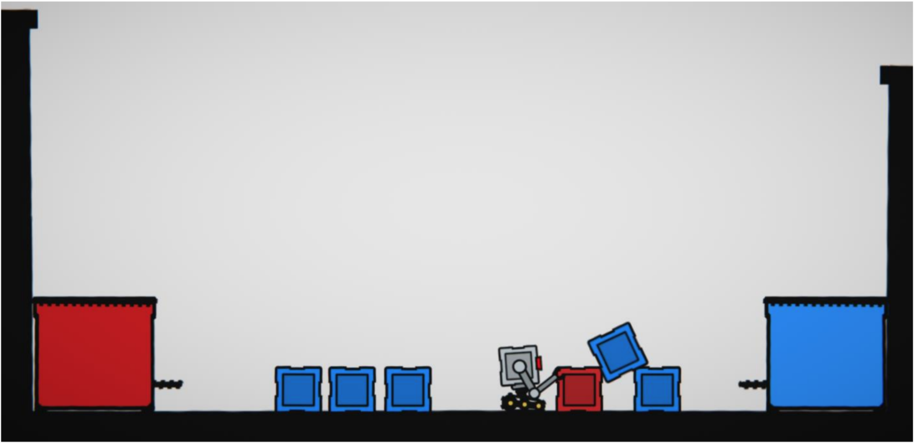

# Zadatak 1

Kreirati AI takav da uzima blokove s poda i sprema ih u odgovarajuću posudu (crveni blok u crvenu posudu, plavi blok u plavu posudu). Blokovi se proizvoljno generiraju na proizvoljnim pozicijama unutar scene. AI ne smije imati listu pozicija svih blokova na sceni. Zadatak mora biti riješen u 2D okruženju.

Unity 2020.3.7f1 LTS

